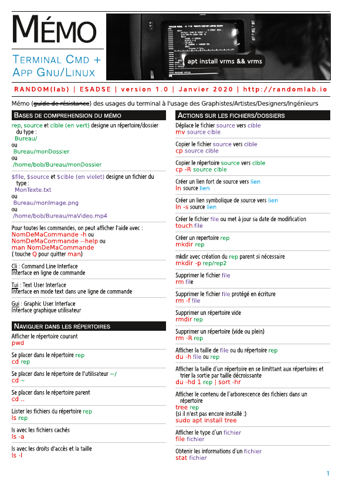
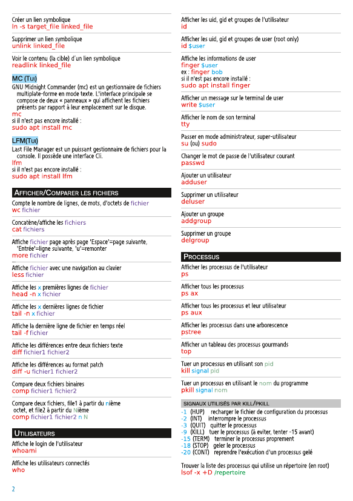
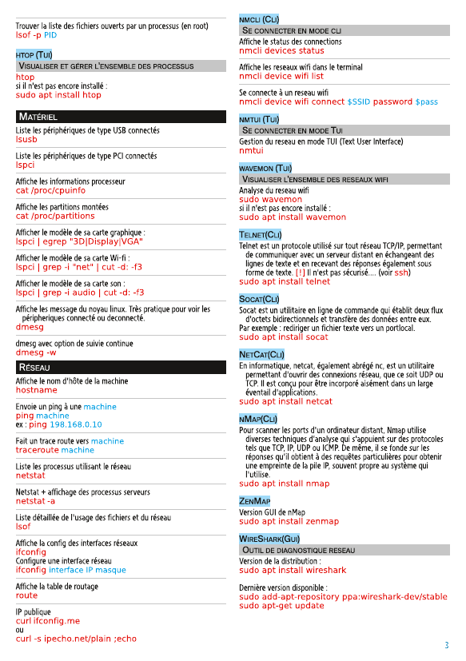
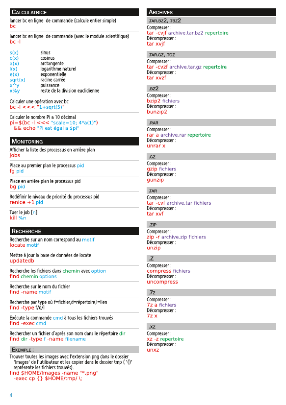
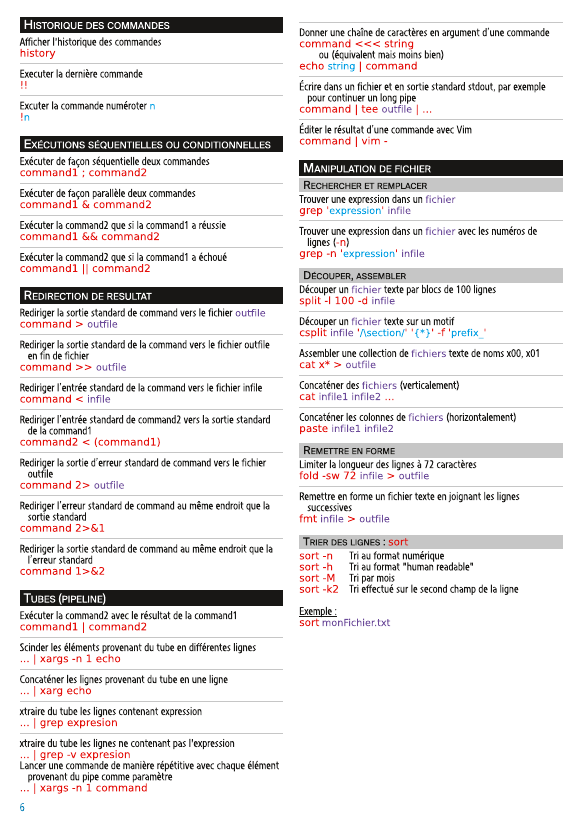
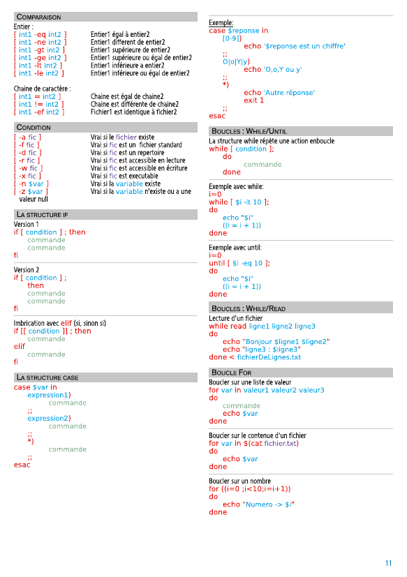
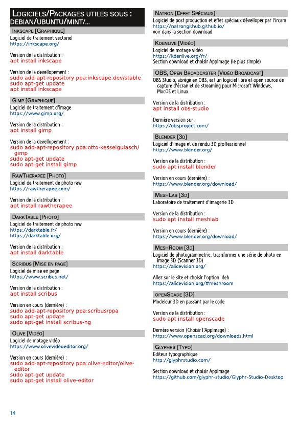
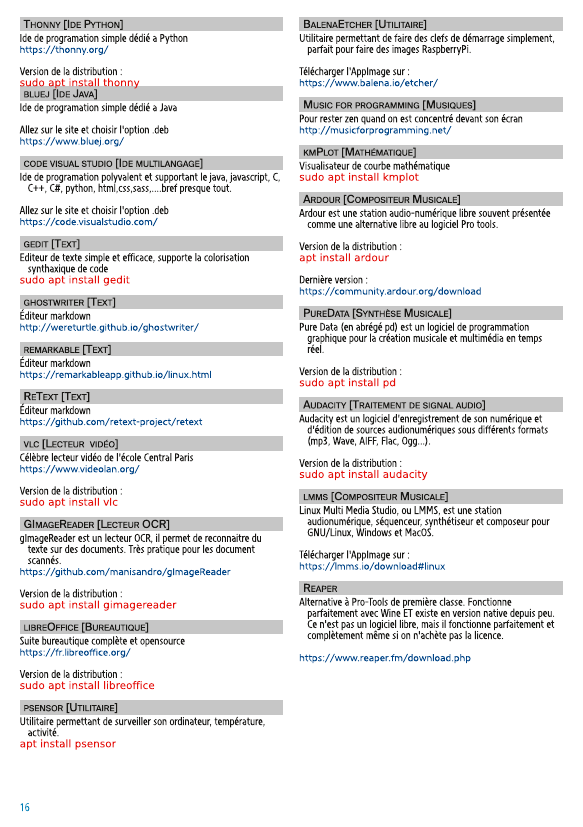
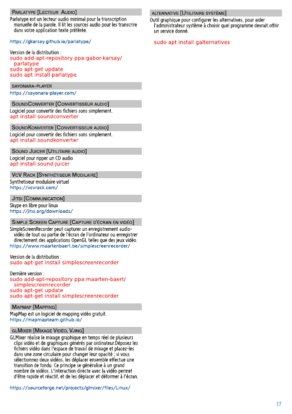
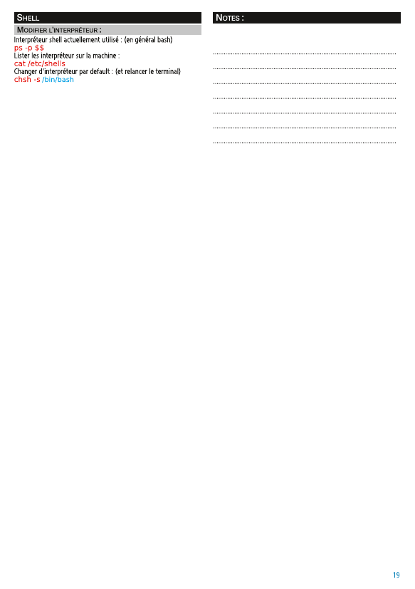

# memo terminal + App Gnu/Linux

Mémo (non exhaustif) à l'usage des Graphistes/Artistes/Designers/Ingénieurs  

Voici un lien où vous pouvez le télécharger :  
-[Télécharger memoCMD](https://github.com/randomDam/memo_cmd/raw/master/memoCMD_v5.pdf)  
(non imposé)  
  
-[Télécharger memoCMD_imp](https://github.com/randomDam/memo_cmd/raw/master/memoCMD_imp.pdf)  
(imposé par planche, imprimez les pages impaires, retournez les pages et imprimez les pages paires)

  
Vous pouvez ensuite l'imprimer par 2 pages recto/verso pour obtenir un livret au format A5.  
N'hésitez pas à ajouter des _Issues_ si vous jugez qu'il manque certaines choses.

---

	
	
	
	
	
	
	
	
	
	
	
	
	
	
	
	
	
	
	
	

---
